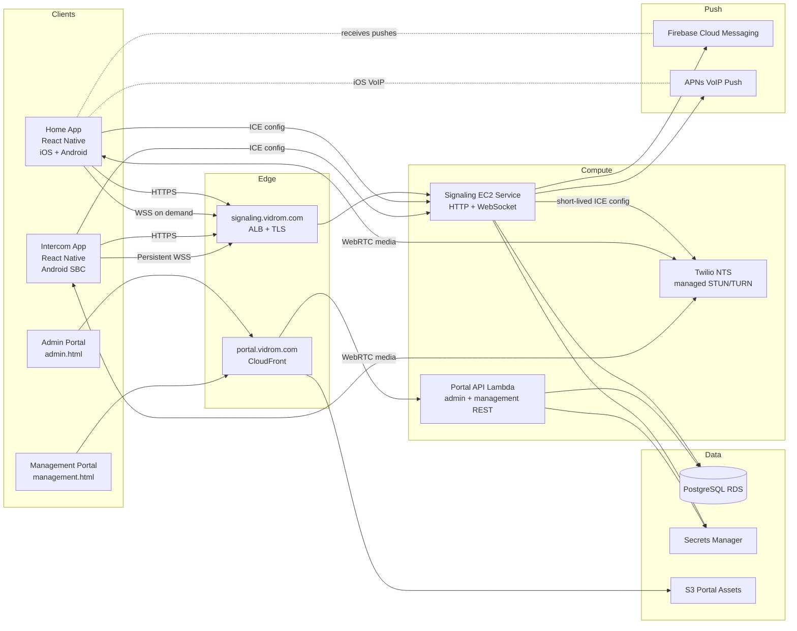

# System Landscape

## Notes

- The home app keeps signaling mostly on demand, while the intercom stays persistently connected.
- Portal HTML is static and served from S3 through CloudFront, but the admin and management APIs run in Lambda.
- The EC2 signaling service still owns both WebSocket signaling and a set of stateful HTTP endpoints used by the mobile apps.
- TURN relay is now provided by Twilio NTS rather than a coturn process on the signaling host.