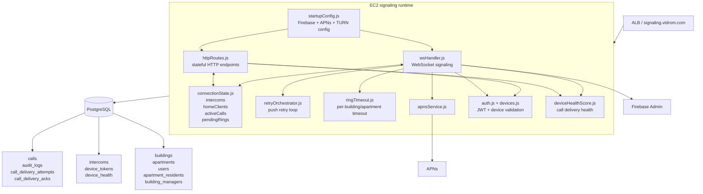

# Runtime Backend Topology

## Responsibilities

- `wsHandler.js` owns signaling, ring fanout, first-accept-wins, watch mode, and push triggers.
- `httpRoutes.js` owns token registration, apartment resolution, device provisioning, delivery acknowledgements, and RTC config.
- `connectionState.js` is the in-memory coordination layer that makes the backend stateful.
- RDS stores the durable model and delivery history, while active call routing still depends on process memory.