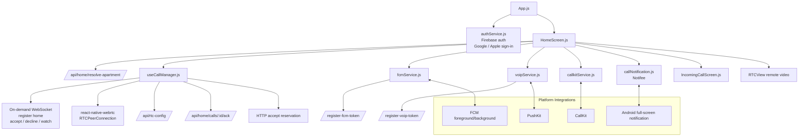

# Home App Architecture

## Notes

- The home app delays WebSocket connection until an incoming call, a watch request, or a resumed call path requires it.
- The app bridges three incoming-call surfaces: FCM, VoIP PushKit, and native call UI.
- The home client is the WebRTC offerer for both calls and watch sessions.