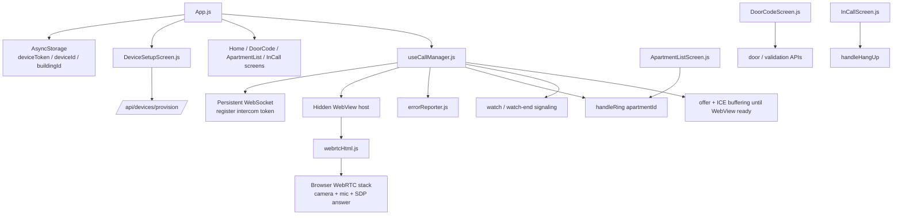

# Intercom App Architecture

## Notes

- The intercom is treated as an always-on kiosk device, so it keeps a persistent signaling socket with reconnect logic.
- WebRTC runs inside a WebView-backed HTML runtime rather than directly through native React Native WebRTC UI.
- The intercom receives offers from the home app and answers them after the WebView initializes camera and microphone capture.