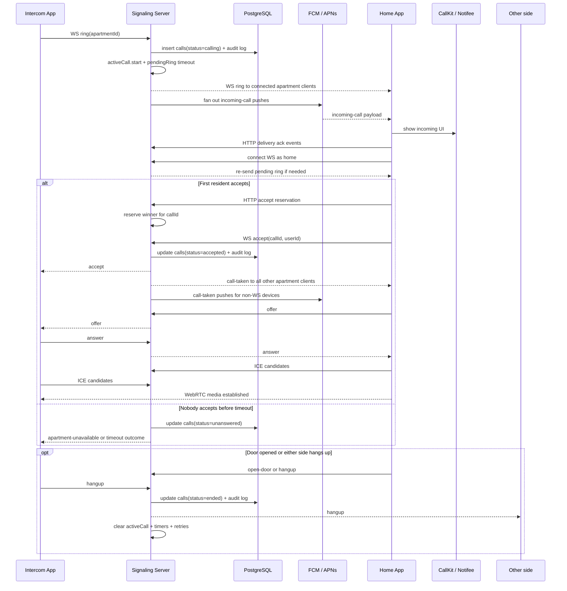

# Incoming Call Flow

## Important Rules

- Call delivery is apartment-scoped, not single-device scoped.
- First accept wins. Every non-winning device must receive `call-taken` quickly.
- The home app is the SDP offerer.