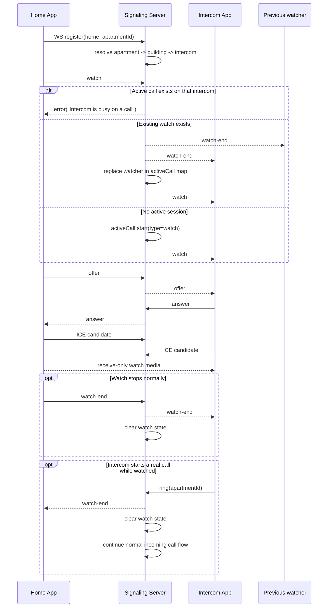

# Watch Flow

```mermaid
sequenceDiagram
    participant Home as Home App
    participant Server as Signaling Server
    participant Intercom as Intercom App

    Home->>Server: WS register(home, apartmentId)
    Server->>Server: resolve apartment -> building -> intercom
    Home->>Server: watch

    alt Active call exists on that intercom
        Server-->>Home: error("Intercom is busy on a call")
    else Existing watch exists
        Server-->>Previous watcher: watch-end
        Server-->>Intercom: watch-end
        Server->>Server: replace watcher in activeCall map
        Server-->>Intercom: watch
    else No active session
        Server->>Server: activeCall.start(type=watch)
        Server-->>Intercom: watch
    end

    Home->>Server: offer
    Server-->>Intercom: offer
    Intercom->>Server: answer
    Server-->>Home: answer
    Home->>Server: ICE candidate
    Intercom->>Server: ICE candidate
    Home-->>Intercom: receive-only watch media

    opt Watch stops normally
        Home->>Server: watch-end
        Server-->>Intercom: watch-end
        Server->>Server: clear watch state
    end

    opt Intercom starts a real call while watched
        Intercom->>Server: ring(apartmentId)
        Server-->>Home: watch-end
        Server->>Server: clear watch state
        Server->>Server: continue normal incoming call flow
    end
```

## Priority Rules

- Call overrides watch.
- Watch never overrides an active call.
- New watch overrides older watch on the same intercom.