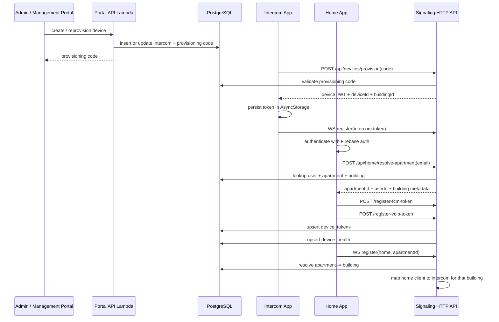

# Provisioning And Token Flow

## What This Flow Establishes

- Intercom identity is device-based and comes from provisioning.
- Home identity is user-based and is later mapped to apartment and building scope.
- Push targeting depends on device token rows stored per apartment and user.