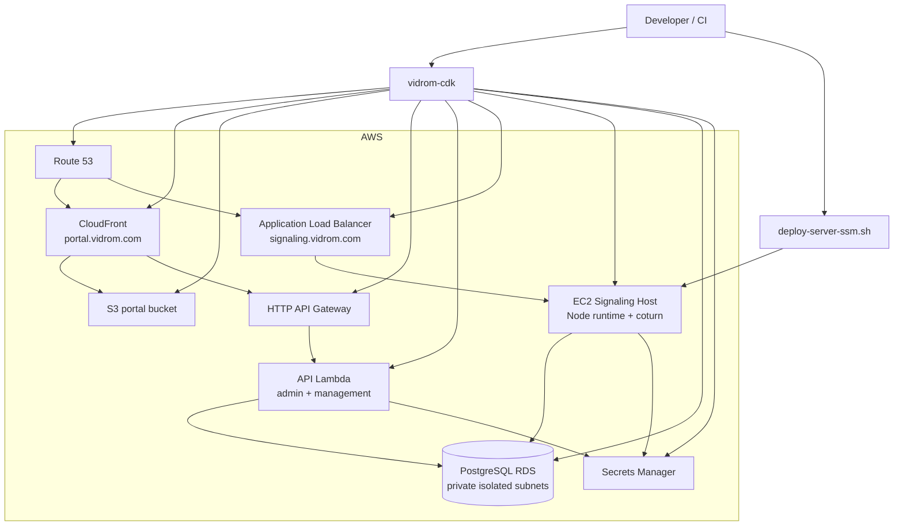

# AWS Deployment Topology

## Deployment Boundaries

- CDK owns infrastructure, DNS, portal assets, and the Lambda API deployment.
- The EC2 signaling code is still deployed separately over SSM.
- RDS is private and shared by both the EC2 signaling service and the Lambda portal APIs.