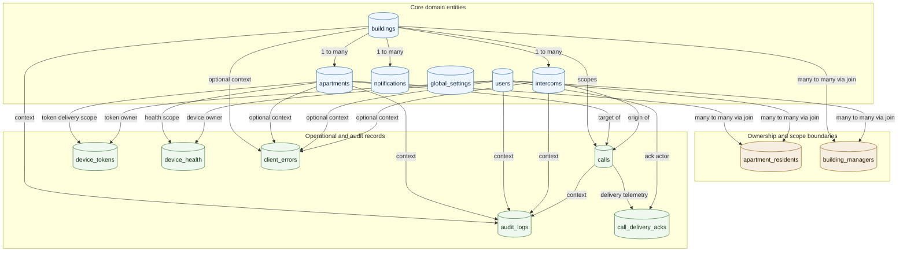

# Database Entities And Ownership Boundaries

## Ownership Model

- `admin` users are global operators. Their access is role-based and not constrained by join tables.
- `manager` users are constrained by `building_managers`, which defines which buildings they can administer.
- `resident` users are constrained by `apartment_residents`, which defines which apartments and therefore which building-scoped calls and notifications they can access.
- `intercom` devices are constrained by `intercoms.building_id`, which binds each device to one building.

## Boundary Notes

- `apartment_residents` is the main resident authorization boundary for the home app.
- `building_managers` is the management-portal authorization boundary.
- `device_tokens` and `device_health` are not standalone identity sources. They must stay subordinate to the owning `users` and `apartments` records.
- `calls`, `audit_logs`, and `call_delivery_acks` are operational records whose visibility should be derived from apartment or building ownership, not from caller-supplied IDs.